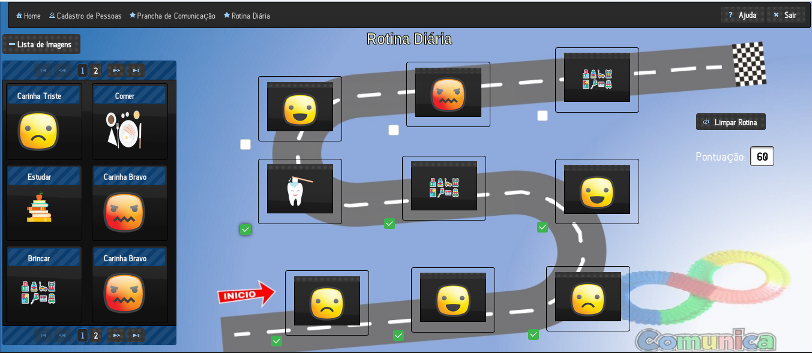

## Sistema Comunica

### Projeto

### Objetivo
A principal finalidade do sistema é auxiliar as pessoas que possuem o transtorno do autismo a realizarem suas tarefas de forma facilitada, com interações e distribuição das informações.

### Desenvolvedores
- <a href="https://github.com/rodrigoge">Rodrigo Gouveia</a>
- <a href="https://github.com/JPDutra">João Paulo Dutra</a>

### Tecnologias
- JavaWeb (JSF e JPA)
- MySQL
- Apache Tomcat Server
- Primefaces
- Hibernate
